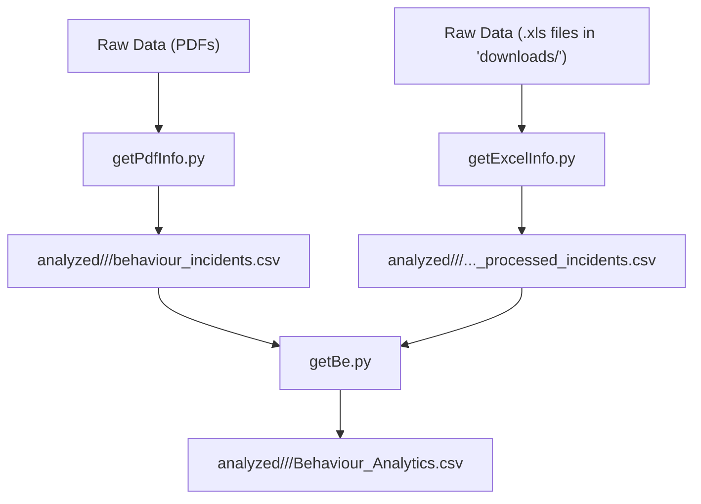

**How to Run This:**

1.) Start a virtual enviroment: 
- python3 -m venv venv
- source venv/bin/activate
- pip install -r requirements.txt
  
2.) Run run_script.py 

3.) You'll see the final outputted files in "analzyed/[homeName]/[date]"

# Behaviours Analysis File Explanation: 

This project contains a series of Python scripts designed to process, analyze, and enrich resident incident data from PDF and Excel files. The pipeline extracts raw data, cleans it, merges it, and uses the OpenAI API to generate insightful analytics.

## Data Flow

The following diagram illustrates the data processing workflow from raw files to the final analytics output:

## Scripts and Workflow

The data processing is divided into three main steps, executed by three separate Python scripts. The `runscript.py` runs these 3 files. 

### Step 1: `getPdfInfo.py` - Extracting Notes from PDFs

*   **What it does:** This script is the starting point for handling behavioral notes from PDF files. It reads through each page of a given PDF, extracts all the text, and specifically looks for sections related to "Behaviour - Responsive Behaviour" and "Incident - Falls." It parses these sections to extract key information like the resident's name, the date and time of the note, and the detailed content of the note itself. It also performs cleaning tasks, such as attempting to reclassify certain fall incidents as "Post Fall - Nursing" notes if they appear to be simple follow-ups with little new information.
*   **Inputs:** PDF files containing resident progress notes.
*   **Outputs:** The script generates a single CSV file named **`behaviour_incidents.csv`** in the project's root directory. This file serves as a database of all the relevant behavioral and fall-related notes extracted from the PDFs.

### Step 2: `getExcelInfo.py` - Processing Incident Reports

*   **What it does:** This script handles structured incident data from Excel (`.xls`) files. It looks for these files in the `downloads/` directory. For each file, it reads the data, filters out irrelevant entries (like those marked "Struck Out"), and formats the data into a clean, standardized structure. It extracts and separates the date and time, determines the resident's unit or "building" from their room number, and compiles a list of injuries by checking a range of columns for a 'Y' marker.
*   **Inputs:** Excel (`.xls`) files located in the **`downloads/`** directory. The script expects filenames to contain the long-term care home's name and the date, which it uses for organization.
*   **Outputs:** The script creates a structured folder system inside the **`analyzed/`** directory. For each input file, it creates a path like `analyzed/<home_name>/<year>_<month>_<day>/`. Inside this final, date-specific folder, it saves a new CSV file named **`<original_filename>_processed_incidents.csv`**.

### Step 3: `getBe.py` - Analysis, Merging, and AI Enrichment

*   **What it does:** This is the final and most complex script in the pipeline. It acts as the "brain" of the operation, merging the narrative, unstructured data from the PDFs with the structured data from the Excel files. It reads the `behaviour_incidents.csv` file and the various `_processed_incidents.csv` files. For each incident, it finds the corresponding behavioral notes based on the resident's name and the incident date.

    The script then heavily relies on the **OpenAI API (gpt-3.5-turbo)** to perform several key tasks:
    *   **Summarize Behaviors:** It condenses long descriptions of behavior into 1-2 sentence summaries.
    *   **Determine POA Contact:** It reads notes to figure out if the Power of Attorney was notified.
    *   **Classify Incidents:** It determines who was involved (e.g., "Resident Initiated," "Staff Received").
    *   **Generate Summaries:** It creates an overall summary of each incident.
    *  **Other functions:** Like critical incidents, code white classification etc.

*   **Inputs:**
    1.  The **`behaviour_incidents.csv`** file (output of `getPdfInfo.py`).
    2.  The **`..._processed_incidents.csv`** files (output of `getExcelInfo.py`).
    3.  An OpenAI API key to perform the analysis.
*   **Outputs:** The script saves its final, enriched dataset as a new CSV file named **`Behaviour_Analytics.csv`**. This file is saved in the *same date-specific subfolder* that `getExcelInfo.py` created: **`analyzed/<home_name>/<year>_<month>_<day>/`**. This is the final output of the entire process.

### Extra Detail: 
homes_db.py tells you the name of the retirement home and therefore how to name the file.

